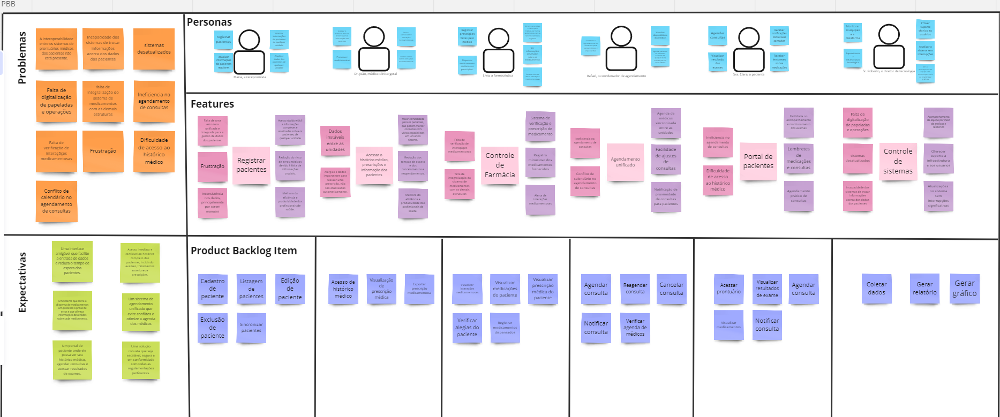
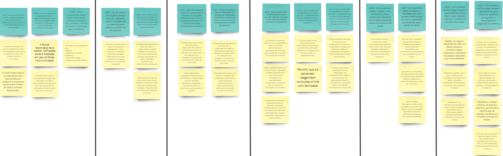
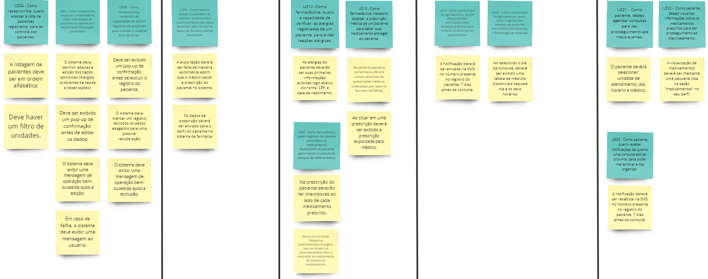
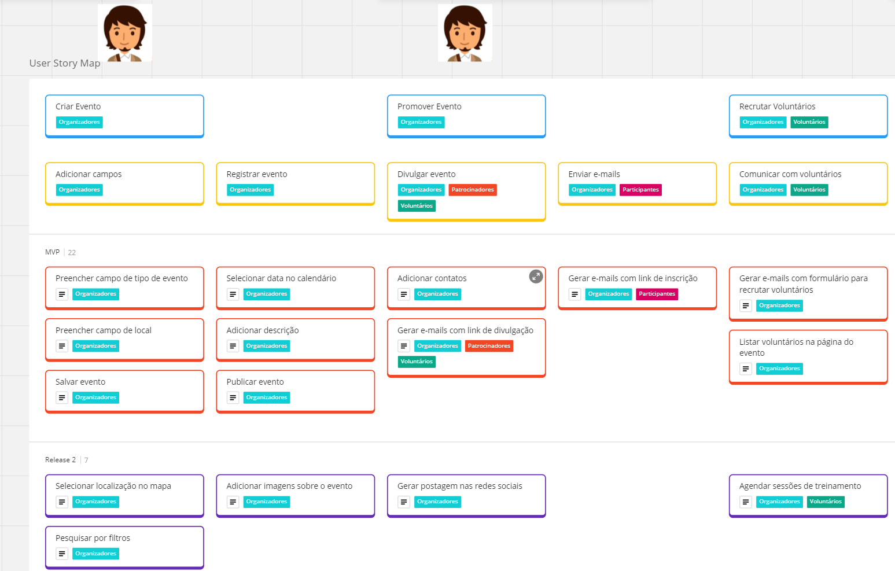
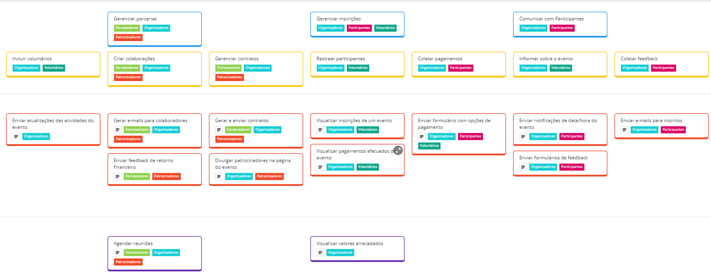

# Entrega Unidade 3
### Lições Aprendidas
Nesta unidade, aprendemos a coordenar melhor as interações da equipe. Isso se deve por causa das dailies, as quais foram adotadas dentro da sprint de desenvolvimento do MVP 1, e também por causa das sessões de programação, as quais necessitam constante feedback interno. As principais dificuldades enfrentadas pelo grupo foram: o choque de horário de alguns membros para poderem realizar atividades importantes da matéria; e a conciliação entre a entrega do MVP 1 e as demais atividades da unidade.

# Entrega 3
<iframe width="560" height="315" src="https://www.youtube.com/embed/obRrP3DubQs?si=OQ4KU4NFiF9aO2lS" title="YouTube video player" frameborder="0" allow="accelerometer; autoplay; clipboard-write; encrypted-media; gyroscope; picture-in-picture; web-share" allowfullscreen></iframe>

# Sprint Review
<iframe width="560" height="315" src="https://www.youtube.com/embed/AmbbmBNNHCQ?si=67pC-aLFiom8mnsn" title="YouTube video player" frameborder="0" allow="accelerometer; autoplay; clipboard-write; encrypted-media; gyroscope; picture-in-picture; web-share" allowfullscreen></iframe>

# PBB

# Critérios

# USM

