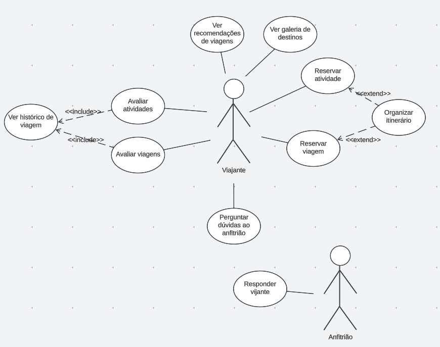

# Entrega Unidade 4
### Lições Aprendidas
Nesta etapa do curso, consolidamos valiosas lições sobre a dinâmica de trabalho em equipe. Aprendemos a aprimorar nossa colaboração, reconhecendo que a chave para o sucesso reside na comunicação efetiva e na compreensão mútua. Contudo, enfrentamos um desafio significativo: lidar com prazos apertados e corridos. A pressão temporal intensificada, agravada pelo acúmulo de matérias e trabalhos no final do semestre, destacou a necessidade crítica de gerenciamento de tempo. A dificuldade em conciliar tantas demandas comprometeu nossa capacidade de dedicar tempo e energia de forma adequada, exigindo flexibilidade e resiliência.

# UML

# Especificação de Caso de Uso 1

# Especificação de Caso de Uso 2

# Especificação de Caso de Uso 3

